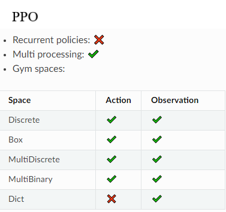
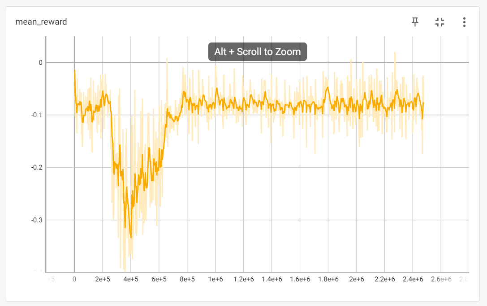

# Poker.AI (Reinforcement Based Poker Robot)
This project was done in collaboration with By Paul Pan, Sruthi Papanasa, Advaith Ravishankar, Vincent Tu with the Data Science Student Soceity at UCSD

Work Splits:
1. Game Environment: Paul Pan and Sruthi Papansa
2. RL Design and Training Model: Paul Pan, Advaith Ravishankar, Vincent Tu
3. GUI Desgin and Creation: Advaith Ravishankar

# Running the Game with the GUI

This repository contains a Poker environment which has a trained RL robot as the robots made usng stable.baseline3. To use the implementation, install the necessary libraries stated in ```requirements.txt``` using ```pip install -r requirements.txt```.

To play the game with the functional GUI, run ```pyhton poker_env.py``` in the terminal. The following window will open up which is made in Tkinter:

<p align ="center">
  
</p>

Play the game as you like. You will be Playing against Bots created by our team with additional suggestions created by our bot.

## RL Algorithm

We created a model based on stable.baseline3's [PPO](https://stable-baselines3.readthedocs.io/en/master/modules/ppo.html) training which requires an observation space to track to develop the decision making process.

<p align ="center">
  
</p>

Observation Space:
1. "actions": All Player Actions
2. "active":  Players which are actvie
3. "chips":   chip total for all players
4. "community_cards": 5 Cards on the table
5. "player_card":  Player card combinations
6. "max_raise":   Total amount player can raise
7. "min_raise":   Minmimum amount player can raise
8. "pot": current size of game bettings
9. "player_stacks": pot_commits for every player in the whole game
10. "stage_bettings": pot_commits for every player in the current stage
11. "hand_score": Player hand's score

# Training Process

The bot was initally trained against a random robot were some were configured to be aggressive while some were trained to be passive. Then the robot trained against previous iterations of itself.

After training for over a million games, the performance measured up to:

<p align ="center">
  
</p>

The reward refers to how the model evaluates if a hand should be played or not. Positive means one should play the game. Negative means you will loose the game so player should fold. 

Ideal performance should be fluctutaions about zero with several peaks in the positves.

# Results

The Robot performed to the point where it could beat itself and the random robots in 100% of the games. However, when a real user plays against the robot, the robot has a high tendency to FOLD which leads to the conclusion that it does not perform up to par.

# Next Steps
Design an algorithm which tries to learn opponenets betting habits learn when to play aggressive or passive rather than playing only passively.
