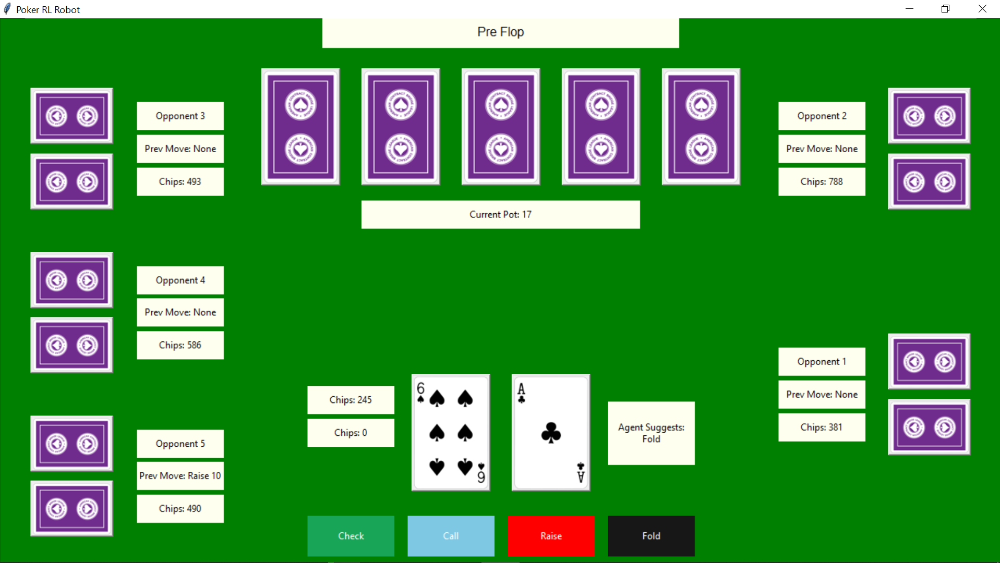

# Poker.AI (Reinforcement Based Poker Robot)
This project was done in collaboration with By Paul Pan, Sruthi Papanasa, Advaith Ravishankar, Vincent Tu with the Data Science Student Soceity at UCSD

Work Splits:
1. Game Environment: Paul Pan and Sruthi Papansa
2. RL Desogn and Training Model: Paul Pan, Advaith Ravishankar, Vincent Tu
3. GUI Desgin and Creation: Advaith Ravishankar

This repository contains a Poker environment which has a trained RL robot as the robots made usng stable.baseline3. To use the implementation, install the necessary libraries stated in ```requirements.txt```.

## GUI

To play the game with the functional GUI, run ```poker_env.py``` with ```show_gui=True```. The following window will open up which is made in tkinter:

<p align ="center">
  
</p>


## RL Algorithm

We created a model based on Stablebaseline.3's 
